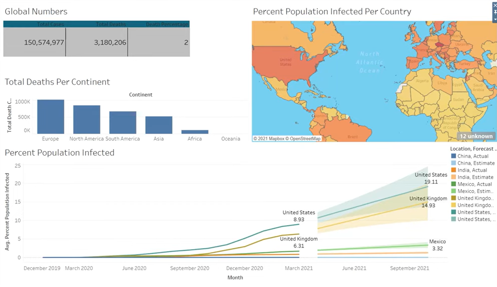

---

## 🧠 Project Objectives
- Analyze **global COVID-19 statistics** — total cases, deaths, and mortality rate.
- Compare **infection percentages across major countries** (India, China, USA).
- Visualize **continent-wise cumulative deaths**.
- Track **infection rate trends over time** to observe outbreak progression.

---

## ⚙️ Tools & Technologies
| Tool | Purpose |
|------|----------|
| **SQL (MySQL / SQL Server)** | Data cleaning, filtering, and aggregation |
| **Tableau** | Interactive visualization and dashboard creation |
| **Excel** | Raw data source and preprocessing |
| **Data Source** | Public datasets (e.g., WHO, Our World in Data) |

---

## 📊 Dashboard Highlights
- **Global Overview Panel** – Displays total cases, total deaths, and death percentage.  
- **Continent-wise Comparison** – Bar chart showing cumulative deaths by continent.  
- **Geo Heatmap** – Visualizes infection percentage by country.  
- **Time-Series Trends** – Tracks infection growth across India, China, and the USA.

---

## 🔍 Key Insights
- The **United States** and **Europe** recorded the highest infection and death rates.  
- **Africa** and **Oceania** reported lower infection rates relative to population size.  
- Infection trends reveal **distinct outbreak patterns** across continents.

---

## 🚀 How to Explore
1. Download and open the `.twbx` file in **Tableau Desktop** or **Tableau Public**.  
2. Use filters to explore data by continent, country, or time range.  
3. Hover over maps and charts for detailed insights.  
4. Refer to `COVID_data - Data Exploration.sql` for SQL preprocessing logic.

---

## 📸 Dashboard Preview

---

